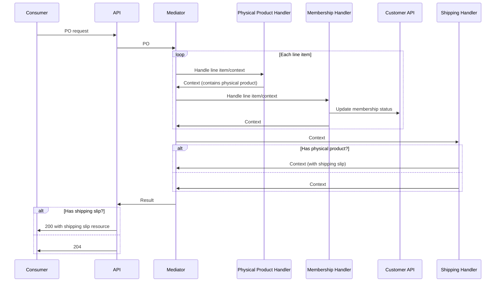
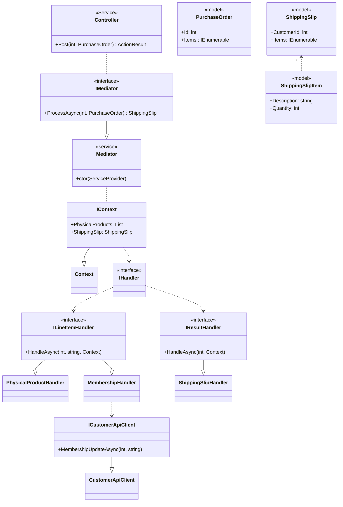
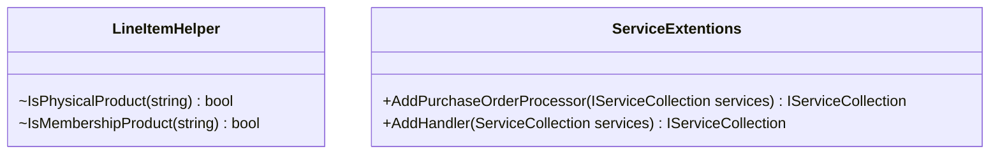

# Fun Books And Videos
*This system will strictly cover the elements described in the requirements PDF, no new features will be invented.* 
## Assumptions
1. A customer accounts API already exists.
4. This product will be an single-process/self-contained API.
	4. Any failures will result in the purchase order not being processed and any actions taken reverted.
5. The first word in the line item will always dictate the type of product.

## Terms

## Features
* Purchase order processing
	* Products
		* Memberships
		* Physical
	* Flexibility to extend with other product types
* Customer Accounts Updates
* Shipping Slip Generation

## Scope
This system does not consume the ```POID``` or the ```Total``` so these values can be disregarded.  The system also does not need to validate the PO against the customers current membership,

The first work of each line item, ```Book``` or ```Video``` is used to denote the product type except for memberships where the text will read: ```Book Club Membership```, ```Video Club Membership``` or ```Premium Membership```.  The line information is also used to produce the shipping slip.

The key elements of the design will need to address the different processing requirements of the various product types, this is also where we can add flexibility to extend the range of products types supported.  Each product type should have a handler and processed using a mediator.  New handlers can be created and register with the mediator as new product types are designed.

As a PO can be processed multiple times and is not required to be fetched, the API needs to only have a single ```POST``` endpoint to submit the PO resource.  The endpoint is idempotent although this is not a requirement, it is also un-safe as it updates the Customer API.  The success results will be either  ```204``` or ```200``` with the shipping slip resource.

There is no storage solution needed for this project.

There is no authentication/authorization/cors/caching/security or infrastructure requirements for this document, any API Gateway is also outside of the scope of this design.  The accepted content type will be ```application/json``` only.

The design must ensure that all aspects of the system are easily unit/integration tested and mocked.

## API Design
```yaml
openapi: 3.0.0
info:
  version: 1.0.0
  title: Fun Books And Videos - Purchase Order Processor
  description: Process purchase orders for customer accouns and produce shipping slips
paths:
  '/{customer}/purchase-orders':
    post:
      description: >-
        Submits a PO resource that wil be processed for the customer and produce
        a shipping slip if required.
      parameters:
        - name: customer
          required: true
          in: path
          schema:
            type: number
      requestBody:
        content:
          application/json:
            schema:
              type: object
              properties:
                id:
                  type: number
                total:
                  type: number
                items:
                  type: array
                  items:
                    type: string
      responses:
        '200':
          description: >-
            The PO has been processed, customer account updated and a shipping
            slip resource produced.
          content:
            application/json:
              schema:
                type: object
                properties:
                  customer:
                    type: number
                  items:
                    type: array
                    items:
                      type: object
                      properties:
                        description:
                          type: string
                        quantity:
                          type: number
        '204':
          description: The PO has been processed and the customer account updated.
        '400':
          description: The PO is invalid or malformed.
```
## PO Processor Design
On startup each handler that exists in the assembly or its dependencies will register with the mediator.  The mediator will create a context that each handler will update.  The mediator iterate through its handlers that accept line items first, then move on to those that only process the context.

The solution will follow the Clean Architecture approach. (https://www.c-sharpcorner.com/article/what-is-clean-architecture/)

To avoid supply chain security checks before deployment, the solution will minimize the use of open source 3rd party packages.

### Example Sequence Diagram

## System Model




The controller is the frameworks API request handler.
The mediator is and handlers will be part of the service collection and supplied by the provider.
The Customer API client has been added to ensure the single responsibility of the handler and to make mocking easier.
Adding new product types should not require any modifications but only additions.
An interface for the context is used to ensure we only depend on abstractions.

## Business Rules Implementation
### Handlers
```csharp
	public class PhysicalProductHandler : ILineItemHandler
	{
		public virtual Task HandleAsync(int customerId, string lineItem, IContext context)
		{
			if(LineItemHelper.IsPhysicalProduct(lineItem))
				context.PhysicalProducts.Add(lineItem);

			return Task.CompletedTask;
		}
	}

	public class MembershipHandler : ILineItemHandler
	{
		private readonly ICustomerApiClient _customerApiClient;
		public MembershipHandler(ICustomerApiClient customerApiClient) => _customerApiClient = customerApiClient;
		
		public Task HandleAsync(int customerId, string lineItem, IContext context)
		{
			if (LineItemHelper.IsMembershipProduct(lineItem))
				_customerApiClient.MembershipUpdateAsync(customerId, lineItem);
			return Task.CompletedTask;
		}
	}

	public class ShippingSlipHandler : IResultHandler
	{
		public Task HandleAsync(int customerId, IContext context)
		{
			if (context.PhysicalProducts.Any())
			{
				var shippingSlipItems = context.PhysicalProducts
					.GroupBy(p => p)
					.Select(p => new ShippingSlipItem
					{
						Description = p.Key,
						Quantity = p.Count()
					});
				context.ShippingSlip = new()
				{
					CustomerId = customerId,
					Items = shippingSlipItems
				};
			}

			return Task.CompletedTask;
		}
	}
```

### Supporting classes
```csharp

	public interface IContext
	{
		public List<string> PhysicalProducts { get; }
		public ShippingSlip? ShippingSlip { get; set; }
	}
	public interface ILineItemHandler
	{
		public Task HandleAsync(int customerId, string lineItem, IContext context);
	}
	public interface IResultHandler
	{
		public Task HandleAsync(int customerId, IContext context);
	}
	public interface ICustomerApiClient
	{
		public Task MembershipUpdateAsync(int customerId, string membership);
	}

	internal static class LineItemHelper
	{
		private static readonly IEnumerable<string> MembershipProducts = new[] {"Book Club Membership", "Video Club Membership", "Premium Membership"};

		public static bool IsPhysicalProduct(string lineItem) => !IsMembershipProduct(lineItem);

		public static bool IsMembershipProduct(string lineItem) => MembershipProducts.Contains(lineItem);
	}

	class Context : IContext
	{
		public List<string> PhysicalProducts { get; } = new();
		public ShippingSlip? ShippingSlip { get; set; }
	}

	public record ShippingSlip
	{
		public int CustomerId { get; init; }
		public IEnumerable<ShippingSlipItem> Items { get; init; } = Array.Empty<ShippingSlipItem>();
	}

	public record ShippingSlipItem
	{
		public string Description { get; init; }
		public int Quantity { get; init; }
	}
```